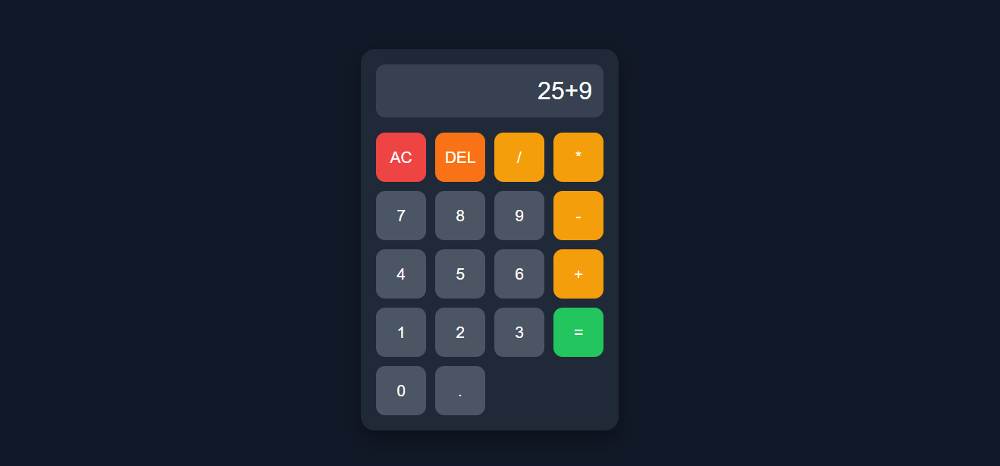

 🧮 Calculator App

A modern and responsive calculator built using **HTML**, **CSS**, and **JavaScript**. This project performs basic arithmetic operations while providing a clean user interface, keyboard support, and input validation for a better user experience.

 🚀 Live Demo

🔗 **Live Website:**  
https://Calculator-APP.github.io/CodeAlpha_CalculatorApp/


## 📸 Screenshot





 ✨ Features

- ➕ Addition
- ➖ Subtraction
- ✖️ Multiplication
- ➗ Division
- 🧹 Clear (AC)
- ⌫ Delete last character (DEL)
- ⌨️ Keyboard support
- 📱 Responsive design
- 🌙 Modern dark theme
- 🚫 Prevents invalid operator sequences
- 🔢 Decimal number support
- ⚡ Real-time display updates
- 🎨 Hover and click animations

 🛠️ Technologies Used

- HTML5
- CSS3
- JavaScript (ES6)


 📂 Project Structure

Calculator-App/
│
├── index.html
├── style.css
├── script.js
├── Screenshots/
│   └── calculator.png
└── README.md

 🧠 What I Learned

Through this project, I practiced:

- DOM Manipulation
- Event Listeners
- Functions
- Conditional Statements
- Arrays and String Methods
- Keyboard Events
- Error Handling using `try...catch`
- Responsive Web Design
- CSS Grid & Flexbox
- Input Validation

🚀 Future Enhancements

Some ideas for future improvements include:

- Replace `eval()` with custom calculation logic
- Add calculation history
- Theme switcher (Light/Dark Mode)
- Scientific calculator functions
- Memory buttons (MC, MR, M+, M-)
- Percentage and parentheses support

💻 How to Run Locally

1. Clone the repository

```bash
git clone https://github.com/Sobia-iqbal56/CodeAlpha_CalculatorApp.git
```

2. Open the project folder.

3. Run `index.html` in your browser.

 👩‍💻 Author

**Sobia Iqbal**

GitHub: https://github.com/Sobia-iqbal56
